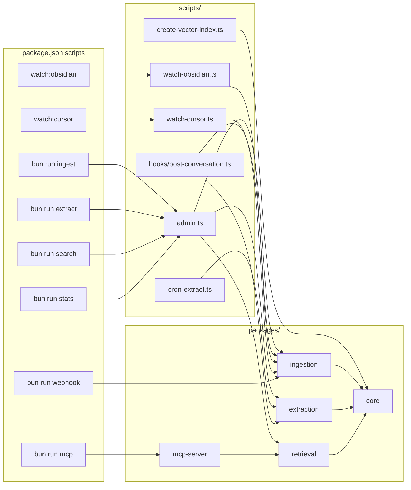

# Scripts y comandos

Todos los scripts viven en `scripts/` y se invocan vía `package.json` o directamente con `bun run`.

## Mapa de relaciones



---

## Scripts npm (`package.json`)

| Comando | Script subyacente | Descripción |
|---------|-------------------|-------------|
| `bun run build` | `bun run --filter '*' build` | Typecheck de todos los packages |
| `bun run ingest` | `scripts/admin.ts ingest` | Ingesta manual por fuente |
| `bun run extract` | `scripts/admin.ts extract` | Ejecuta extracción LLM en batch |
| `bun run search` | `scripts/admin.ts search` | Búsqueda desde terminal |
| `bun run stats` | `scripts/admin.ts stats` | Conteo de documentos por `type` en `knowledge` |
| `bun run mcp` | `scripts/start-mcp.ts` | Inicia MCP server para Cursor |
| `bun run webhook` | `packages/ingestion/src/webhook-server.ts` | Servidor HTTP local de webhooks |
| `bun run watch:obsidian` | `scripts/watch-obsidian.ts` | Watch del vault Obsidian |
| `bun run watch:cursor` | `scripts/watch-cursor.ts` | Watch de transcripts Cursor |

---

## `scripts/admin.ts`

CLI principal de operaciones. Orquesta [[04 - Packages#ingestion|ingestion]], [[04 - Packages#extraction|extraction]] y [[04 - Packages#retrieval|retrieval]].

### `ingest <source> [--path=<path>]`

| Source | Adapter | Requiere |
|--------|---------|----------|
| `cursor` | `packages/ingestion/src/cursor.ts` | `CURSOR_TRANSCRIPTS_DIR` |
| `cursor-file` | `cursor.ts` (un archivo) | `--path=<file.jsonl>` |
| `obsidian` | `packages/ingestion/src/obsidian.ts` | `OBSIDIAN_VAULT_PATH` o `--path` |
| `chatgpt` | `packages/ingestion/src/chatgpt.ts` | `CHATGPT_EXPORT_PATH` o `--path` |
| `jira` | `packages/ingestion/src/jira.ts` | `JIRA_BASE_URL`, `JIRA_EMAIL`, `JIRA_API_TOKEN` |

```bash
bun run ingest cursor
bun run ingest obsidian --path="C:/Users/me/vault"
bun run ingest chatgpt --path="./conversations.json"
bun run ingest jira
```

**Relación:** llama a `ingestRawContent()` → [[04 - Packages#ingestion|chunker + embeddings + MongoDB]]

### `extract [--limit=50]`

Ejecuta `runExtractionBatch()` de [[04 - Packages#extraction|packages/extraction]].

```bash
bun run extract
bun run extract --limit=200
```

**Relación:** lee `knowledge` (`type: conversation`, `extracted !== true`) → LLM → escribe en `knowledge` (`type: decision|pattern|incident`)

**Salida esperada:**

```
Running extraction batch (limit=50)...
{ processed: 5, extracted: 2, skipped: 3 }
```

| Campo | Significado |
|-------|-------------|
| `processed` | Conversaciones revisadas en el batch |
| `extracted` | Conocimiento útil guardado (confidence ≥ 0.3) |
| `skipped` | Sin valor o confidence baja; se marcan `extracted: true` igual |

**Requisitos:** Ollama corriendo (`ollama serve`) o `LLM_PROVIDER=openai` con API key.

### `search <query> [--type=incident|pattern|decision]`

Búsqueda desde terminal usando [[04 - Packages#retrieval|packages/retrieval]].

```bash
bun run search "CORS SvelteKit Lambda"
bun run search "SSR deployment" --type=incident
```

### `stats`

Muestra conteo total en `knowledge` y desglose por `type`, incluyendo documentos pendientes de extracción.

```bash
bun run stats
```

**Salida de ejemplo:**

```
knowledge: 42 documents (8 unextracted)
  conversation: 30 (8 unextracted)
  decision: 5 (0 unextracted)
  incident: 4 (0 unextracted)
  pattern: 3 (0 unextracted)
```

| Indicador | Hook funcionando | Extract funcionando |
|-----------|------------------|---------------------|
| `conversation` total sube | ✓ (nuevos transcripts) | — |
| `unextracted` en `conversation` baja | — | ✓ |
| `decision` / `pattern` / `incident` suben | — | ✓ |

Ejecuta `stats` **antes y después** de hook/extract para comparar.

---

## `scripts/create-vector-index.ts`

**Cuándo ejecutar:** una vez, después de configurar `MONGODB_URI`.

**Qué hace:**
1. Crea índices estándar en `knowledge` (`contentHash`, `source`, `project`, `tags`, `extracted`, `type`)
2. Intenta crear **un** índice vectorial en `knowledge` vía driver
3. Si falla, imprime la definición JSON para crearlo manualmente en Atlas UI

**Relación:** usa `ensureIndexes()` y `VECTOR_INDEX_DEFINITION` de [[04 - Packages#core|packages/core/src/db.ts]]

```bash
bun run scripts/create-vector-index.ts
```

> **Nota:** en Atlas M0 el índice vectorial puede requerir creación manual. Dimensiones: 768 (Ollama), 1536 (OpenAI), 1024 (Voyage).

---

## `scripts/migrate-to-polymorphic.ts`

**Cuándo ejecutar:** una vez, si ya tienes datos en las colecciones legacy (`conversations`, `decisions`, `code_patterns`, `incidents`).

**Qué hace:**
1. Lee todos los documentos de las 4 colecciones legacy
2. Los inserta en `knowledge` (omite duplicados por `contentHash`)
3. Imprime conteos por `type`
4. **No** elimina las colecciones legacy (seguridad — eliminar manualmente en Atlas tras verificar)

```bash
bun run scripts/migrate-to-polymorphic.ts
```

**Relación:** migración one-shot hacia la arquitectura polimórfica de [[02 - Arquitectura]].

---

## `scripts/watch-cursor.ts`

**Modo:** daemon — observa `CURSOR_TRANSCRIPTS_DIR` recursivamente.

**Qué hace:**
- Detecta archivos `.jsonl` nuevos o modificados en `agent-transcripts/`
- Debounce de 2 segundos
- Llama a `ingestCursorFile()` por cada archivo

**Relación:** automatiza la ingesta de [[Cursor]] sin intervención manual.

```bash
bun run watch:cursor
```

---

## `scripts/watch-obsidian.ts`

**Modo:** daemon — observa `OBSIDIAN_VAULT_PATH`.

**Qué hace:**
- Detecta cambios en archivos `.md`
- Debounce de 3 segundos
- Re-ingesta el archivo modificado vía `ingestRawContent()`

**Relación:** mantiene sincronizado el vault [[Obsidian]] con MongoDB.

```bash
# Requiere OBSIDIAN_VAULT_PATH en .env
bun run watch:obsidian
```

---

## `scripts/cron-extract.ts`

**Modo:** job batch — diseñado para cron o Task Scheduler.

**Qué hace:** ejecuta `runExtractionBatch(200)` sobre documentos con `extracted: false`.

**Relación:** complementa el hook post-conversación para procesar backlog.

```bash
bun run scripts/cron-extract.ts
```

**Programar en Windows (Task Scheduler):**
```
Programa: bun
Argumentos: run scripts/cron-extract.ts
Directorio: F:\Git\personal-rag
Frecuencia: semanal, domingo 2:00 AM
```

---

## `scripts/hooks/post-conversation.ts`

**Ubicación:** `scripts/hooks/post-conversation.ts`  
**Entrypoint Cursor:** `.cursor/hooks/post-conversation.ts` (wrapper que importa el script)  
**Registro:** `.cursor/hooks.json` → evento `stop`

**Cuándo se ejecuta:** automáticamente al terminar un chat en Cursor (hook `stop` en `.cursor/hooks.json`).

**Flujo:**
1. Busca el transcript `.jsonl` más reciente en `agent-transcripts/`
2. Lo ingesta con `ingestCursorFile()`
3. Si hubo inserciones, ejecuta `runExtractionBatch(5)`

**Probar manualmente:**
```bash
bun run post-conversation
# o
bun run scripts/hooks/post-conversation.ts
```

**Salida esperada (stderr):**

```
[post-conversation] Ingesting C:\Users\...\agent-transcripts\....jsonl
[post-conversation] Ingested: inserted=3, skipped=0
[post-conversation] Extracted: processed=3, extracted=1
```

| Mensaje | Significado |
|---------|-------------|
| `No transcript found` | No hay `.jsonl` en `agent-transcripts/` o `CURSOR_TRANSCRIPTS_DIR` incorrecto |
| `inserted=0, skipped=N` | El transcript ya estaba en MongoDB (dedup por `contentHash`) |
| `inserted>0` | Ingesta OK; el hook lanza extract automático (batch de 5) |
| `Error: ...` | Fallo de MongoDB, Ollama, `.env`, etc. |

**Verificar que Cursor lo ejecuta solo:**
1. Abrir **Output** → canal **Hooks**
2. Terminar un chat (cerrar conversación o empezar otra)
3. Deberían aparecer las mismas líneas `[post-conversation] ...`

> Hook de **proyecto** (`.cursor/hooks.json`): solo corre con el workspace `personal-rag` abierto.  
> Hook **global** (`~/.cursor/hooks.json`): corre en cualquier repo — ver [[10 - MCP y Hooks globales]].

**Relación:** cierra el loop automático Cursor → MongoDB → conocimiento estructurado.

---

## `packages/ingestion/src/webhook-server.ts`

No está en `scripts/` pero se invoca con `bun run webhook`.

**Endpoints:**
| Ruta | Evento |
|------|--------|
| `POST /webhooks/github` | PRs, pushes (verifica `x-hub-signature-256`) |
| `POST /webhooks/gitlab` | MRs, pushes (verifica `x-gitlab-token`) |
| `GET /health` | Health check |

**Relación:** usa adapters [[GitHub]] y [[GitLab]] de `packages/ingestion`.

```bash
bun run webhook
# Escucha en WEBHOOK_PORT (default 3456)
```

Ver también: [[05 - Infraestructura]], [[07 - Guía de inicio]]

---

## Verificar hook y extract

Checklist para confirmar que la ingesta automática y la extracción LLM funcionan.

### Paso a paso

| # | Acción | OK si… |
|---|--------|--------|
| 1 | `bun run stats` | Hay documentos `conversation` |
| 2 | `bun run post-conversation` | `inserted > 0` o `skipped` (ya existía) |
| 3 | `bun run stats` de nuevo | Total subió o `unextracted` cambió |
| 4 | `bun run extract` | `processed > 0` en la salida |
| 5 | `bun run stats` | `unextracted` baja; suben `decision` / `pattern` / `incident` |
| 6 | Cerrar un chat en Cursor | Logs `[post-conversation]` en canal **Hooks** |
| 7 | `bun run search "tema del chat" --type=decision` | Retorna resultados extraídos |

### Problemas frecuentes

| Síntoma | Causa probable | Solución |
|---------|----------------|----------|
| Hook no corre en otros repos | Solo configurado a nivel proyecto | Copiar hook a `~/.cursor/hooks.json` con ruta absoluta |
| `inserted=0` siempre | Transcript ya ingerido | Normal (dedup); prueba con chat nuevo |
| `extracted=0, skipped=N` | LLM no encontró conocimiento útil | Chats cortos o sin contenido técnico; prueba conversación más larga |
| Extract falla / timeout | Ollama no disponible | `ollama serve` + verificar `OLLAMA_BASE_URL` |
| `extracted: false` no baja | Backlog grande | `bun run extract --limit=200` o [[03 - Scripts y comandos#cron-extract.ts\|cron-extract.ts]] |
