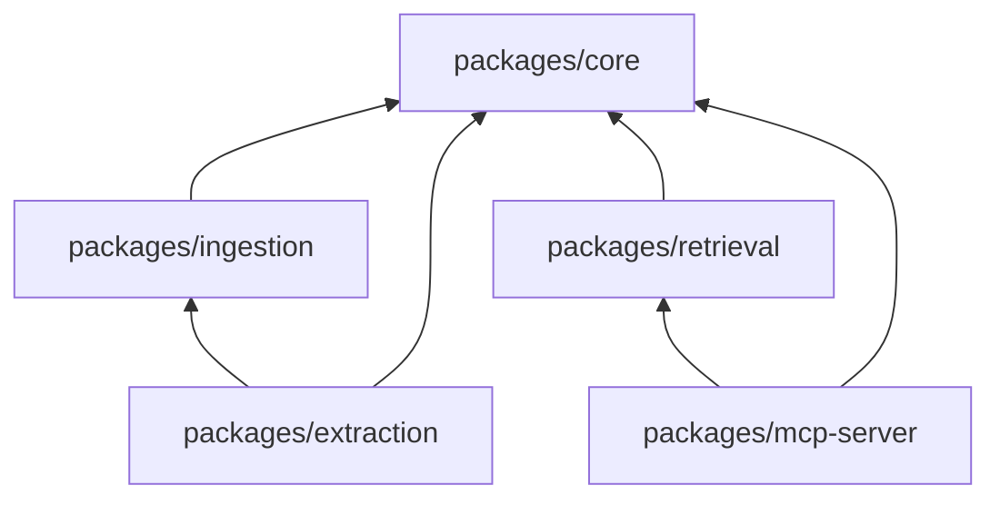

# Packages

Monorepo Bun con 5 packages en `packages/`. Todos dependen de `@personal-rag/core`.

## Dependencias entre packages



---

## `packages/core`

Fundación compartida. No tiene dependencias internas del monorepo.

| Archivo | Responsabilidad |
|---------|-----------------|
| `src/models.ts` | Schemas Zod, tipos TypeScript, nombres de colecciones |
| `src/config.ts` | Lectura de variables de entorno (`.env`) |
| `src/db.ts` | Cliente MongoDB singleton, índices, `hashContent()` |
| `src/embeddings.ts` | Cliente abstracto: Ollama / OpenAI / Voyage |
| `src/llm.ts` | Cliente abstracto: Ollama / OpenAI para extracción |
| `src/index.ts` | Re-exports públicos |

**Usado por:** todos los demás packages y [[03 - Scripts y comandos#create-vector-index.ts|create-vector-index.ts]]

**Variables clave:** `MONGODB_URI`, `EMBEDDING_PROVIDER`, `LLM_PROVIDER`

---

## `packages/ingestion` {#ingestion}

Pipeline de ingesta y adapters por fuente.

| Archivo | Fuente | Tipo de ingesta |
|---------|--------|-----------------|
| `src/base.ts` | — | Chunk → embed → dedup upsert |
| `src/chunker.ts` | — | División de texto (512 palabras, overlap 64) |
| `src/cursor.ts` | Cursor | Transcripts `.jsonl` recursivos |
| `src/github.ts` | GitHub | Webhook PR/push |
| `src/gitlab.ts` | GitLab | Webhook MR/push |
| `src/obsidian.ts` | Obsidian | Walk de vault `.md` |
| `src/chatgpt.ts` | ChatGPT | Parse `conversations.json` |
| `src/jira.ts` | Jira | REST API search |
| `src/webhook-server.ts` | GitHub/GitLab | Servidor HTTP Bun |
| `src/lambda/handler.ts` | GitHub/GitLab | Handler AWS Lambda |

**Invocado por:** [[03 - Scripts y comandos#admin.ts|admin.ts]], watchers, hooks, webhooks

---

## `packages/extraction` {#extraction}

Extracción de conocimiento estructurado post-ingesta.

| Función | Descripción |
|---------|-------------|
| `extractFromDocument()` | Envía contenido al LLM, parsea JSON |
| `saveExtractedKnowledge()` | Guarda en `knowledge` con el `type` extraído |
| `runExtractionBatch()` | Procesa N conversaciones con `extracted !== true` |

**Output del LLM:**
```json
{
  "problem": "...",
  "solution": "...",
  "type": "incident|decision|pattern",
  "confidence": 0.92,
  "tags": ["bun", "lambda"],
  "technologies": ["bun", "aws-lambda"]
}
```

**Umbral:** documentos con `confidence < 0.3` se marcan como procesados sin guardar.

**Invocado por:** `bun run extract`, [[03 - Scripts y comandos#cron-extract.ts|cron-extract.ts]], [[03 - Scripts y comandos#post-conversation.ts|post-conversation.ts]]

**Verificar:** [[03 - Scripts y comandos#Verificar hook y extract]] — `bun run extract` debe retornar `{ processed, extracted, skipped }`; `bun run stats` debe mostrar `unextracted` bajando en `conversation`.

---

## `packages/retrieval` {#retrieval}

Capa de búsqueda vectorial + fallback textual.

| Función | Colección(es) |
|---------|---------------|
| `searchKnowledge()` | Todas |
| `searchIncidents()` | `incidents` |
| `searchPatterns()` | `code_patterns` |
| `searchDecisions()` | `decisions` |
| `searchArchitecture()` | `decisions` + `code_patterns` |
| `formatSearchResults()` | — (formatea markdown) |

**Filtros soportados:** `project`, `source`, `tags`, `repository`, `dateRange`, `type`, `limit`

**Invocado por:** [[03 - Scripts y comandos#admin.ts|admin.ts search]], [[04 - Packages#mcp-server|mcp-server]]

---

## `packages/mcp-server` {#mcp-server}

Expone retrieval como herramientas MCP para Cursor.

| Tool MCP | Función retrieval |
|----------|-------------------|
| `searchKnowledge` | `searchKnowledge()` |
| `searchIncidents` | `searchIncidents()` |
| `searchPatterns` | `searchPatterns()` |
| `searchDecisions` | `searchDecisions()` |
| `searchArchitecture` | `searchArchitecture()` |

**Configuración:** `.cursor/mcp.json`

```bash
bun run mcp
```

Ver también: [[02 - Arquitectura]], [[03 - Scripts y comandos]]
