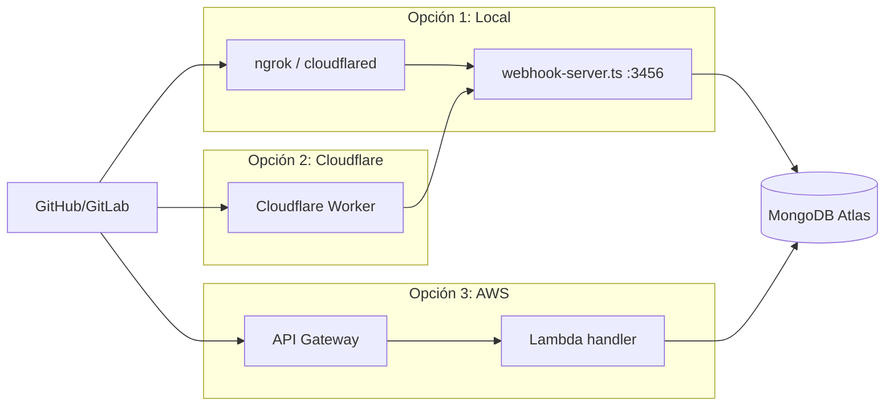

# Infraestructura

La carpeta `infra/` contiene opciones de despliegue para **webhooks de GitHub/GitLab**. La ingesta local (Cursor, Obsidian, ChatGPT, Jira) no requiere infra adicional.

## Por qué existe

GitHub y GitLab necesitan un endpoint HTTP público para enviar eventos (PR merged, push, etc.). Tienes tres opciones:

| Opción | Costo | Cuándo usarla |
|--------|-------|---------------|
| Servidor local (`bun run webhook`) | $0 | Desarrollo, túnel con ngrok/cloudflared |
| Cloudflare Workers | $0 (100K req/día) | Proxy ligero hacia tu servidor |
| AWS Lambda + API Gateway | ~$0 (free tier) | Producción sin mantener servidor |

---

## Servidor local — `packages/ingestion/src/webhook-server.ts`

```bash
bun run webhook
# POST http://localhost:3456/webhooks/github
# POST http://localhost:3456/webhooks/gitlab
```

**Para exponerlo a internet (desarrollo):**
```bash
# Opción A: ngrok
ngrok http 3456

# Opción B: cloudflared
cloudflared tunnel --url http://localhost:3456
```

Configura la URL pública en GitHub/GitLab → Settings → Webhooks.

**Variables requeridas:**
- `GITHUB_WEBHOOK_SECRET` — secret del webhook de GitHub
- `GITLAB_WEBHOOK_SECRET` — token del webhook de GitLab
- `MONGODB_URI` — para persistir eventos

**Relación:** usa adapters de `packages/ingestion/src/github.ts` y `gitlab.ts` → [[04 - Packages#ingestion|ingestion pipeline]]

---

## Cloudflare Workers — `infra/cloudflare/`

Proxy gratuito que reenvía webhooks a tu servidor de ingesta.

| Archivo | Función |
|---------|---------|
| `worker.ts` | Handler que forward requests a `INGESTION_WEBHOOK_URL` |
| `wrangler.toml` | Configuración de despliegue |

```bash
cd infra/cloudflare
npx wrangler deploy worker.ts
```

**Variables de entorno en Cloudflare:**
- `INGESTION_WEBHOOK_URL` — URL de tu servidor (local con túnel o Lambda)

**Flujo:**
```
GitHub/GitLab → Cloudflare Worker → tu servidor webhook → MongoDB
```

**Costo:** $0 en free tier (100,000 requests/día).

---

## AWS Lambda + API Gateway — `infra/terraform/`

Despliegue serverless completo para producción.

| Archivo | Función |
|---------|---------|
| `main.tf` | Lambda, IAM role, API Gateway HTTP, rutas |
| `terraform.tfvars.example` | Variables de ejemplo |

**Recursos que crea Terraform:**
- `aws_lambda_function.webhook` — ejecuta `packages/ingestion/src/lambda/handler.ts`
- `aws_apigatewayv2_api` — API HTTP con rutas `/webhooks/github` y `/webhooks/gitlab`
- IAM role con permisos básicos de ejecución

**Despliegue:**
```bash
cd infra/terraform
cp terraform.tfvars.example terraform.tfvars
# Editar: mongodb_uri, github_webhook_secret, gitlab_webhook_secret

terraform init
terraform plan
terraform apply
```

**Outputs:**
- `github_webhook_url` — URL para configurar en GitHub
- `gitlab_webhook_url` — URL para configurar en GitLab

**Variables sensibles:**
| Variable | Descripción |
|----------|-------------|
| `mongodb_uri` | Conexión Atlas |
| `github_webhook_secret` | Verificación HMAC GitHub |
| `gitlab_webhook_secret` | Token GitLab |
| `embedding_provider` | `ollama` o `openai` (Lambda no puede usar Ollama local) |

> **Nota:** Lambda en producción debe usar `EMBEDDING_PROVIDER=openai` porque Ollama corre localmente. Para $0 en embeddings desde Lambda, considera pre-procesar en local y que Lambda solo persista texto sin embedding.

**Costo AWS:** ~$0 con free tier (1M requests Lambda/mes, API Gateway incluido en tier básico).

---

## Diagrama de opciones de webhook



Ver también: [[03 - Scripts y comandos#webhook-server.ts]], [[06 - Costos]]
