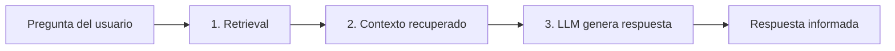
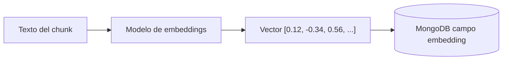
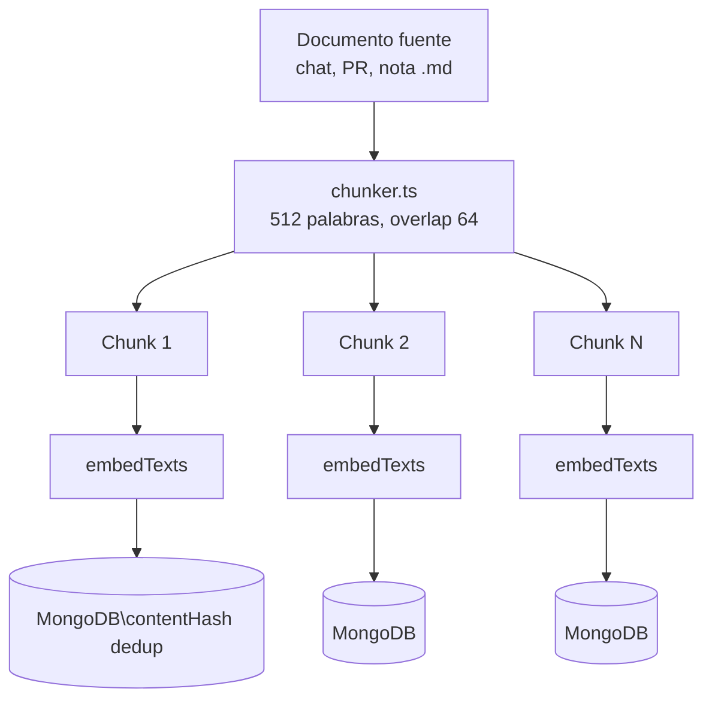
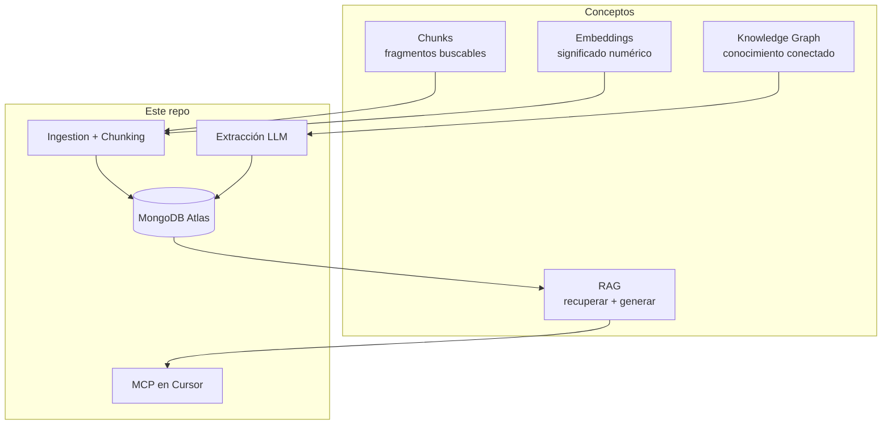

# Fundamentos teóricos

> **Lee esta nota primero** si es tu primera vez con el repo. Explica los conceptos clave antes de entrar en [[02 - Arquitectura|arquitectura]] o [[07 - Guía de inicio|guía de inicio]].

## Índice de conceptos

| Concepto | Sección |
|----------|---------|
| [[#Qué es Personal Engineering Knowledge Graph\|Knowledge Graph personal]] | Grafo de conocimiento de ingeniería |
| [[#Qué es RAG\|RAG]] | Retrieval-Augmented Generation |
| [[#Por qué MongoDB Atlas\|MongoDB Atlas]] | Vector store elegido |
| [[#Qué son los embeddings\|Embeddings]] | Cómo se vectoriza un documento |
| [[#Por qué chunks y qué es overlap\|Chunking y overlap]] | División de textos largos |

---

## Qué es Personal Engineering Knowledge Graph

Un **Knowledge Graph** (grafo de conocimiento) es una forma de organizar información donde las piezas están **conectadas entre sí por relaciones**, no solo apiladas en carpetas.

En un grafo tradicional de empresa podrías tener:

```
[Proyecto coffee-platform]
    ├── [Decisión: SSR en Lambda] ←── vinculada a ──→ [PR #542]
    ├── [Incidente: CORS 502]     ←── resuelto en ──→ [Chat Cursor 2026-03]
    └── [Patrón: API GW → Lambda → DynamoDB]
```

Un **Personal Engineering Knowledge Graph** aplica esa idea a *tu* historial técnico personal:

- Tus chats con Cursor, Copilot o ChatGPT
- Tus PRs, commits y reviews
- Tus notas de Obsidian y ADRs
- Tus tickets de Jira

### Para qué sirve

| Sin Knowledge Graph | Con Knowledge Graph |
|---------------------|---------------------|
| "¿Cómo lo resolví?" → buscas en 10 chats viejos | Preguntas en lenguaje natural → el sistema encuentra el incidente exacto |
| Decisiones enterradas en PRs nunca documentadas | Decisiones extraídas y buscables por proyecto/tecnología |
| Repites errores ya resueltos | Cursor recupera tu solución anterior antes de responder |
| Conocimiento fragmentado por herramienta | Vista unificada: Cursor + GitHub + Obsidian + Jira en un solo lugar |

En este repo, el "grafo" no es un grafo Neo4j clásico con nodos y aristas explícitas. Es un **grafo implícito**: documentos en MongoDB con metadata rica (`project`, `source`, `tags`, `pr`, `repository`) que permiten conectar piezas de conocimiento por contexto compartido.

### Las 4 colecciones = 4 tipos de nodo

| Colección | Qué representa en el grafo |
|-----------|---------------------------|
| `conversations` | Interacciones crudas (chats, PRs sin procesar) |
| `decisions` | Nodos de decisión arquitectónica |
| `code_patterns` | Nodos de patrón reutilizable |
| `incidents` | Nodos de problema resuelto |

La **extracción LLM** ([[04 - Packages#extraction|packages/extraction]]) convierte conversaciones crudas en nodos tipados de mayor valor.

---

## Qué es RAG

**RAG** = **R**etrieval-**A**ugmented **G**eneration (Generación Aumentada por Recuperación).

### El problema que resuelve

Un LLM (GPT, Claude, Llama) solo sabe lo que aprendió en entrenamiento. No sabe:

- Qué desplegaste ayer en *tu* proyecto
- Qué error resolviste hace 3 meses
- Qué decisión tomó tu equipo en el PR #542

Si le preguntas directamente, **inventa o generaliza**. RAG evita eso.

### Cómo funciona (3 pasos)



1. **Retrieval (recuperación):** buscas en tu base de conocimiento los fragmentos más relevantes para la pregunta
2. **Augmentation (aumentación):** esos fragmentos se inyectan como contexto en el prompt del LLM
3. **Generation (generación):** el LLM responde usando *tu* información, no solo su entrenamiento

### Ejemplo concreto

**Pregunta:** *"¿Cómo resolvimos CORS en SvelteKit en coffee-platform?"*

**Sin RAG:** el LLM da una respuesta genérica de documentación pública.

**Con RAG:**
1. `searchIncidents("CORS SvelteKit coffee-platform")` encuentra tu incidente de marzo 2026
2. Cursor recibe: *"Problem: cross-site POST forbidden. Solution: configurar origin y host header en svelte.config.js..."*
3. El LLM responde basándose en **tu solución real**

### RAG en este repo

| Capa | Implementación |
|------|----------------|
| Almacenamiento | MongoDB Atlas ([[#Por qué MongoDB Atlas]]) |
| Recuperación | `packages/retrieval` — búsqueda vectorial |
| Exposición | `packages/mcp-server` — tools MCP en Cursor |
| Ingesta | `packages/ingestion` — alimentar la base |

Este repo va **más allá del RAG naive** (prompt + respuesta cruda). Extrae conocimiento estructurado (problema, solución, decisión) antes de indexarlo → ver [[01 - Objetivo]].

---

## Por qué MongoDB Atlas

### Qué necesitamos del almacenamiento

1. **Guardar documentos** con metadata (JSON flexible)
2. **Búsqueda vectorial** — encontrar chunks similares semánticamente
3. **Filtros combinados** — "incidentes de SvelteKit en coffee-platform de 2026"
4. **Costo $0** para uso personal
5. **Managed** — sin administrar servidores

### Por qué Atlas y no otras opciones

| Opción | Pros | Contras | Veredicto |
|--------|------|---------|-----------|
| **MongoDB Atlas M0** | JSON nativo, Vector Search integrado, free tier, filtros metadata + vector en una query | 512 MB límite en M0 | **Elegido** |
| Pinecone | Especializado en vectores | Servicio separado, otro vendor, free tier limitado | Overkill para personal |
| Qdrant (self-hosted) | Open source, sin límite storage | Requiere Docker/servidor propio | Buena alternativa ([[06 - Costos]]) |
| PostgreSQL + pgvector | Familiar si ya usas Postgres | Setup más manual, sin free tier managed tan simple | Viable pero más fricción |
| ChromaDB local | Simple, local | No managed, no escala a webhooks cloud | Solo dev local |
| Elasticsearch | Potente full-text | Pesado, costoso, overkill | No |

### Ventajas específicas para este proyecto

**1. Documento + vector en el mismo lugar**

Un chunk en MongoDB contiene todo junto:

```json
{
  "content": "Configurar origin en svelte.config.js...",
  "embedding": [0.12, -0.34, ...],
  "project": "coffee-platform",
  "type": "incident",
  "tags": ["sveltekit", "cors"]
}
```

No necesitas sincronizar una DB relacional con un vector store separado.

**2. `$vectorSearch` con pre-filtros**

Una sola query combina similitud semántica + filtros:

```javascript
$vectorSearch: {
  queryVector: [...],
  filter: { project: "coffee-platform", type: "incident" }
}
```

Implementado en [[04 - Packages#retrieval|packages/retrieval/src/search.ts]].

**3. Free tier suficiente**

- M0: 512 MB → ~100,000 chunks de ~500 palabras
- Para años de conversaciones personales, sobra
- Vector Search funciona en M0

**4. Ya encaja con el stack AWS/Terraform**

Si despliegas webhooks en Lambda ([[05 - Infraestructura]]), el driver `mongodb` de Node funciona igual desde local, Lambda o Cursor MCP.

---

## Qué son los embeddings

Un **embedding** es una representación numérica de un texto: un **vector** (lista de números) que captura su *significado semántico*.

### Analogía simple

Imagina que cada texto es un punto en un mapa. Textos con significado similar están **cerca** en ese mapa:

```
                    "error CORS en SvelteKit"
                           •
          "cross-origin POST forbidden" •    • "configurar origin header"
                                             
     • "receta de café"          (lejos, sin relación)
```

Los embeddings convierten texto → coordenadas en un espacio de N dimensiones (768 con Ollama, 1536 con OpenAI).

### Cómo se vectoriza un documento en este repo



**Paso a paso:**

1. Tienes un chunk de texto: `"Lambda no carga .env con Bun"`
2. Lo envías al modelo de embeddings (Ollama `nomic-embed-text` o OpenAI `text-embedding-3-small`)
3. El modelo devuelve un array de floats, ej. 768 números
4. Ese array se guarda en el campo `embedding` del documento MongoDB
5. En búsqueda, tu *pregunta* también se convierte a vector
6. MongoDB encuentra los vectores más **cercanos** (cosine similarity)

### Código en el repo

```typescript
// packages/core/src/embeddings.ts
const [embedding] = await embedTexts(["Lambda no carga .env con Bun"]);
// → [0.023, -0.156, 0.891, ...]  (768 dimensiones con Ollama)
```

### Por qué no basta buscar por palabras clave

| Búsqueda por keyword | Búsqueda por embedding |
|---------------------|------------------------|
| "CORS" no encuentra "cross-origin" | Encuentra textos semánticamente similares |
| "Lambda timeout" no encuentra "function exceeded 30s" | Entiende que son el mismo concepto |
| Requiere coincidencia exacta | Tolera sinónimos, paráfrasis, otro idioma |

### Proveedores en este repo

| Provider | Modelo | Dimensiones | Costo |
|----------|--------|-------------|-------|
| Ollama (Path A) | `nomic-embed-text` | 768 | $0 |
| OpenAI (Path B) | `text-embedding-3-small` | 1536 | ~$0/mes |
| Voyage (Path B+) | `voyage-code-2` | 1024 | Free tier |

Configuración: `EMBEDDING_PROVIDER` en `.env` → [[06 - Costos]]

> **Importante:** las dimensiones del índice vectorial en Atlas deben coincidir con el modelo. Si cambias de Ollama (768) a OpenAI (1536), debes recrear el índice.

---

## Por qué chunks y qué es overlap

### El problema: los textos son demasiado largos

Un chat de Cursor puede tener 50,000 palabras. Un PR con reviews igual. Pero:

- Los modelos de embedding tienen **límite de tokens** (~8K)
- Un vector de 50K palabras es **demasiado genérico** — pierde detalle
- En RAG quieres recuperar el **fragmento exacto** relevante, no un documento entero

**Solución:** dividir el texto en **chunks** (fragmentos) más pequeños.

### Qué es un chunk

Un chunk es un pedazo del documento original, indexado por separado con su propio embedding y metadata.

```
Documento original (2000 palabras)
├── Chunk 0: palabras 0–512      → embedding A
├── Chunk 1: palabras 448–960    → embedding B  (overlap con chunk 0)
├── Chunk 2: palabras 896–1408   → embedding C
└── Chunk 3: palabras 1344–2000  → embedding D
```

Implementado en `packages/ingestion/src/chunker.ts`.

### Configuración en este repo

```env
CHUNK_SIZE=512      # palabras por chunk
CHUNK_OVERLAP=64    # palabras compartidas entre chunks adyacentes
```

### Qué es el overlap

**Overlap** = palabras que se repiten al final de un chunk y al inicio del siguiente.

```
Chunk 1: [palabra 1 ... palabra 512]
Chunk 2:          [palabra 449 ... palabra 960]
                   ↑
                   64 palabras de overlap (512 - 64 = 448 de avance)
```

### Por qué overlap importa

Sin overlap, una idea que **corta justo en la frontera** entre dos chunks se pierde:

```
Chunk 1 termina en:  "...configura el header"
Chunk 2 empieza en:  "Origin en svelte.config.js para CORS..."
```

La frase completa *"configura el header Origin en svelte.config.js"* queda partida. Ningún chunk tiene el contexto completo → peor embedding → peor recuperación.

Con overlap de 64 palabras, ambos chunks contienen la frase completa → mejor chance de encontrarla.

### Trade-offs

| Chunk más grande | Chunk más pequeño |
|-----------------|-------------------|
| Más contexto por fragmento | Más preciso, fragmentos focalizados |
| Embedding más genérico | Embedding más específico |
| Menos chunks = menos storage | Más chunks = más storage y embeddings |

| Overlap mayor | Overlap menor |
|--------------|---------------|
| Mejor continuidad en fronteras | Menos duplicación |
| Más chunks totales | Riesgo de perder contexto en cortes |

**512 / 64** es un balance razonable para conversaciones técnicas en inglés/español. Ajustable en `.env`.

### Flujo completo: de documento a chunks indexados



Cada chunk se deduplica por `contentHash` — si ingestas el mismo texto dos veces, se salta ([[04 - Packages#ingestion|base.ts]]).

---

## Cómo encaja todo junto



**Siguiente paso:** [[07 - Guía de inicio]] para ponerlo en marcha, o [[02 - Arquitectura]] para ver el diseño técnico.
