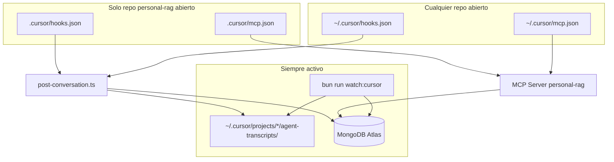

# MCP y Hooks — Alcance global vs proyecto

## Respuesta corta

| Componente | Config actual | ¿Funciona en otros repos? |
|------------|---------------|---------------------------|
| MCP `personal-rag` | `.cursor/mcp.json` del repo | **No** — solo cuando abres `personal-rag` como workspace |
| Hook `post-conversation` | `.cursor/hooks.json` del repo | **No** — solo al terminar chats en este repo |
| Knowledge base (MongoDB) | Global | **Sí** — es tuya, independiente del repo abierto |
| Transcripts Cursor | `~/.cursor/projects/*` | **Sí** — Cursor guarda chats de *todos* tus proyectos ahí |

El **cerebro** (MongoDB) ya es global. Lo que falta es que el **hook** y el **MCP** se registren a nivel usuario, no solo a nivel proyecto.

---

## Cómo funciona Cursor



---

## Opción 1 — Configuración global (recomendada)

Instala `personal-rag` **una vez** en una ruta fija (ej. `F:\Git\personal-rag`) y regístralo en Cursor a nivel usuario.

### MCP global

Copia la plantilla del repo:

```
config/cursor-global/mcp.json.example  →  C:\Users\TU_USUARIO\.cursor\mcp.json
```

O agrégalo manualmente en **Cursor → Settings → MCP → Add**:

```json
{
  "mcpServers": {
    "personal-rag": {
      "command": "C:\\Users\\TU_USUARIO\\.bun\\bin\\bun.exe",
      "args": ["F:\\Git\\personal-rag\\scripts\\start-mcp.ts"]
    }
  }
}
```

> **Windows:** usa la ruta **absoluta** a `bun.exe`. Cursor lanza MCP con un `PATH` mínimo y `"command": "bun"` suele fallar con `connected=false, statusType=error`.
>
> Ajusta ambas rutas a tu instalación real. El script `scripts/start-mcp.ts` hace `chdir` al repo y carga `.env` automáticamente — no necesitas `cwd`.

Con esto, en **cualquier proyecto** Cursor tendrá las tools `searchKnowledge`, `searchIncidents`, etc.

### Hook global

Copia la plantilla:

```
config/cursor-global/hooks.json.example  →  C:\Users\TU_USUARIO\.cursor\hooks.json
```

Contenido (ruta absoluta al script):

```json
{
  "version": 1,
  "hooks": {
    "stop": [
      {
        "command": "bun F:/Git/personal-rag/scripts/hooks/post-conversation.ts",
        "timeout": 120
      }
    ]
  }
}
```

**Importante:** en hooks de usuario las rutas son relativas a `~/.cursor/` *o* absolutas. Usa ruta absoluta al script de `personal-rag` para evitar confusiones.

El hook ya lee transcripts de **todos** los proyectos en `CURSOR_TRANSCRIPTS_DIR` (default: `~/.cursor/projects`). Al trabajar en `coffee-platform`, `frontend`, etc., al terminar un chat se ingesta ese transcript con metadata del proyecto correcto.

### `.env` global

El MCP y el hook cargan `.env` desde `F:\Git\personal-rag` (por `chdir` en el script). No necesitas copiar `.env` a cada repo.

---

## Opción 2 — Daemon `watch:cursor` (sin hook)

Si no quieres hooks globales, deja corriendo:

```bash
cd F:\Git\personal-rag
bun run watch:cursor
```

Observa **todos** los transcripts bajo `~/.cursor/projects` sin importar qué repo tengas abierto en Cursor. Es ingesta pasiva (sin extracción LLM automática al cierre del chat).

Combínalo con cron semanal:

```bash
bun run scripts/cron-extract.ts
```

---

## Opción 3 — MCP/hook por proyecto (no recomendado)

Podrías copiar `.cursor/mcp.json` y `.cursor/hooks.json` a cada repo, pero:

- Duplicas configuración
- `cwd` debe apuntar siempre a `personal-rag`
- Mantenimiento pesado

Mejor usar config **global** una sola vez.

---

## Qué pasa en la práctica por repo

| Estás trabajando en… | MCP global | Hook global | Transcript guardado |
|---------------------|------------|-------------|---------------------|
| `personal-rag` | ✓ | ✓ | ✓ |
| `coffee-platform` | ✓ | ✓ | ✓ |
| `frontend` | ✓ | ✓ | ✓ |
| Repo sin config local | ✓ (si global) | ✓ (si global) | ✓ |

La búsqueda MCP filtra por `project`, `repository`, `tags` — así puedes preguntar *"¿qué hicimos en coffee-platform?"* aunque estés en otro repo.

---

## Checklist — usar en todos tus repos

- [ ] Clonar `personal-rag` en ruta fija
- [ ] Configurar `.env` (MongoDB, Ollama/OpenAI)
- [ ] Copiar `config/cursor-global/mcp.json.example` → `~/.cursor/mcp.json`
- [ ] Ajustar rutas absolutas: `bun.exe` y `scripts/start-mcp.ts`
- [ ] Copiar `config/cursor-global/hooks.json.example` → `~/.cursor/hooks.json`
- [ ] Ajustar ruta absoluta en hooks.json
- [ ] Reiniciar Cursor
- [ ] Verificar MCP en Settings → MCP (5 tools visibles)
- [ ] `bun run post-conversation` → salida `Ingested: inserted=N`
- [ ] `bun run extract` → `{ processed, extracted, skipped }`
- [ ] `bun run stats` → `unextracted` baja tras extract
- [ ] Terminar un chat en otro repo y revisar logs en canal **Hooks**

Ver también: [[07 - Guía de inicio]], [[03 - Scripts y comandos#Verificar hook y extract]]

---

## Troubleshooting MCP (Windows)

| Síntoma en logs | Causa | Solución |
|-----------------|-------|----------|
| `connected=false, statusType=error` | Cursor no encuentra `bun` en PATH | Usar ruta absoluta: `"command": "C:\\Users\\...\\.bun\\bin\\bun.exe"` |
| `Timeout waiting for EverythingProvider` | El proceso MCP no arrancó | Misma solución; probar manualmente: `C:\Users\...\bun.exe F:\Git\personal-rag\scripts\start-mcp.ts` |
| Tools conectan pero búsqueda falla | `.env` no cargado | Verificar `MONGODB_URI` en `F:\Git\personal-rag\.env` |
